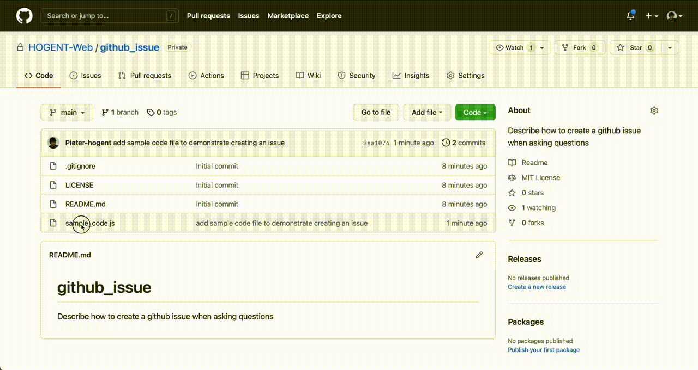
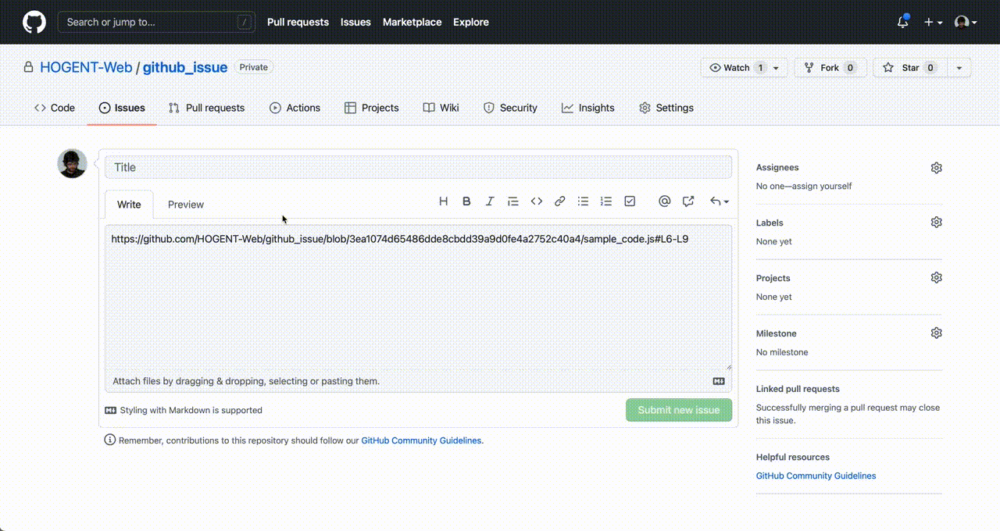
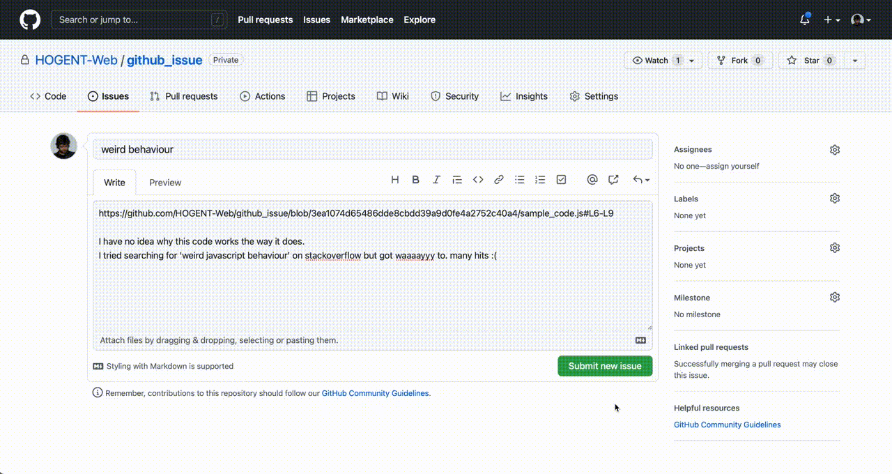

# How to ask a JavaScript question?

First of all, never ask something on Teams, we don't respond to chat messages.
(some of us are in a -lot- of meetings, those chat messages get lost and you won't get an answer at all)

You can send a mail if that's appropriate, although we vastly prefer it if you create a github issue and tag your lecturer.
For us it's immediately obvious which course / class / student / code section / branch is involved, you'll get a better answer, faster.

## Github issue

There are basically two types of questions, the ones involving a piece of code, and the more general ones.
For both we prefer github issues.

### Involving some code

On github navigate to the (source) file involving your question. Click the margin at the start of the section on which you have a question, and shift-click the end.

Now select the 'reference in new issue' option in the '...'

Describe what you don't understand / doesn't work as you'd expect it to, and tell us what you've already tried yourself.
(stackoverflow search / ...)

Make sure to always put in some effort to find a solution yourself (you're here to learn after all)

Now create the issue and assign your lecturer to the issue

And done! Wait for a (hopefully helpful) answer.

### not involving code

The same, but instead of selecting code and clicking the 'new issue', click on the 'issues' tab at the top and start from there.

Good luck!